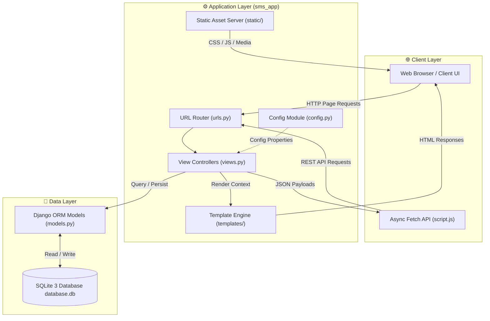

<div align="center">

# 🎓 NRIIT Student Management System (SMS)

**A Modern, High-Performance Academic & Student Management Platform built with Django & SQLite**

[](https://www.python.org/)
[](https://www.djangoproject.com/)
[](https://www.sqlite.org/)
[](LICENSE)

</div>

---

## 📌 Overview

The **NRIIT Student Management System (SMS)** is a full-stack web application developed for **NRI Institute of Technology (Deemed to be University)**. It provides a seamless portal for managing student enrollments, course offerings, faculty profiles, and student inquiries. 

Engineered with a **modular single-app Django architecture (`sms_app`)**, the system features a **Classic Light Academic UI Theme**, responsive components, and an automated REST API layer for real-time frontend interactions.

---

## ✨ Key Features

- **🎓 Course Management**: Complete CRUD operations for courses, featuring duration badges, learning mode pills (Online/Offline), and topics filtering.
- **👨‍🏫 Mentor & Faculty Directory**: Detailed trainer profiles with skill badges, years of experience, and specialized domains.
- **📊 Interactive Analytics Dashboard**: Real-time metric cards displaying live counts for enrolled students, active courses, expert trainers, and pending student inquiries.
- **👥 Student Administration**: Admin directory to view, update, and manage student accounts and enrollments.
- **📬 Student Inquiries & Ticketing**: Contact portal for student queries with status tracking (`Pending` / `Resolved`).
- **🔐 User Authentication**: Student registration and authentication system with role-based dashboard redirection (Student vs Admin).
- **🎨 Classic Light Academic Theme**: Clean visual system built with custom CSS variables, Plus Jakarta Sans typography, and responsive cards.

---

## 🏗️ System Architecture & Data Flow

The platform follows a clean **Model-View-Template (MVT) & REST API** hybrid architecture:



### Architectural Highlights
1. **Client Layer**: Responsive HTML5 user interface styled with CSS design tokens, driven by asynchronous JavaScript `fetch()` calls for zero-reload data updates.
2. **Controller & Router Layer**: Centralized Django URL dispatcher (`sms_app/urls.py`) routing page views and REST endpoints to custom function-based controllers (`sms_app/views.py`).
3. **Data Layer**: High-performance Django ORM mapping application entities (`User`, `Course`, `Trainer`, `Contact`) directly to an embedded SQLite 3 relational database (`database.db`).
4. **Single-Package Modularity**: All domain logic, settings (`settings.py`), deployment hooks (`wsgi.py`/`asgi.py`), page templates, and static assets are self-contained within [`sms_app/`](sms_app).

---

## 🛠️ Tech Stack

| Domain | Technologies Used |
| :--- | :--- |
| **Backend Framework** | [Python 3.13](https://python.org) • [Django 6.1](https://djangoproject.com) |
| **Database** | [SQLite 3](https://sqlite.org) (Integrated ORM with automatic migrations) |
| **Frontend UI** | HTML5 • CSS3 (Design Tokens & Classic Theme) • Vanilla JavaScript (Async ES6+) |
| **Architecture** | Single-Package Modular App (`sms_app`) • Centralized `config.py` |
| **Typography & Icons** | [Plus Jakarta Sans](https://fonts.google.com/specimen/Plus+Jakarta+Sans) • SVG Brand Assets |

---

## 📂 Directory Layout

```text
Student_management_system/
├── sms_app/                      # Modular Application Directory
│   ├── templates/                # HTML Page Templates
│   │   ├── index.html            # Landing / Home Page
│   │   ├── courses.html          # Course Directory & Modals
│   │   ├── trainers.html         # Faculty Directory & Modals
│   │   ├── admin.html            # Admin Management Dashboard
│   │   ├── contact.html          # Student Inquiry Portal
│   │   ├── about.html            # University Overview
│   │   ├── login.html            # Student & Admin Login
│   │   └── register.html         # Student Registration
│   ├── static/                   # Static Assets
│   │   ├── css/                  # Design System Stylesheets
│   │   ├── js/                   # Interactive Scripting & API Fetchers
│   │   ├── images/               # University Brand Logo & Banner Assets
│   │   ├── audio/                # Audio Resources
│   │   └── video/                # Video Resources
│   ├── migrations/               # Database Schema Migrations
│   ├── models.py                 # Django ORM Models (User, Course, Trainer, Contact)
│   ├── views.py                  # Page Renderers & REST API Controllers
│   ├── urls.py                   # Unified URL Routing & Asset Server
│   ├── settings.py               # Django Application Settings
│   ├── apps.py                   # App Registry Configuration
│   ├── wsgi.py                   # WSGI Server Entry Point
│   └── asgi.py                   # ASGI Server Entry Point
├── config.py                     # Centralized Project Configuration Module
├── config                        # JSON Configuration File
├── database.db                   # Persistent SQLite Database
├── manage.py                     # Administrative Command Runner
└── requirements.txt              # Project Python Dependencies
```

---

## 🚀 Quick Start & Installation

### Prerequisites
- Python **3.10** or higher
- Git

### 1. Clone the Repository
```bash
git clone https://github.com/Rishikvelagapudi/Student-Management-System.git
cd Student-Management-System
```

### 2. Create & Activate Virtual Environment
```bash
# Windows
python -m venv env
.\env\Scripts\activate

# macOS / Linux
python3 -m venv env
source env/bin/activate
```

### 3. Install Dependencies
```bash
pip install -r requirements.txt
```

### 4. Apply Database Migrations
```bash
python manage.py migrate
```

### 5. Launch the Development Server
```bash
python manage.py runserver
```
> **Note**: `manage.py` automatically defaults to port **5000** as specified in `config.py`.

Visit the application in your browser at **[http://127.0.0.1:5000](http://127.0.0.1:5000)**.

---

## 📡 REST API Documentation

The platform provides a comprehensive RESTful JSON API layer:

| Endpoint | Method | Description |
| :--- | :---: | :--- |
| `/api/stats` | `GET` | Fetch live counts for students, courses, trainers, and inquiries |
| `/api/courses` | `GET` / `POST` | Retrieve all courses or create a new course |
| `/api/courses/<id>` | `PUT` / `DELETE` | Update course details or delete a course |
| `/api/trainers` | `GET` / `POST` | Retrieve all trainers or add a new faculty member |
| `/api/trainers/<id>` | `PUT` / `DELETE` | Update trainer profile or remove a trainer |
| `/api/users` | `GET` | List all registered students (Admin only) |
| `/api/users/<id>` | `PUT` / `DELETE` | Update student profile or delete account |
| `/api/contacts` | `GET` / `POST` | Retrieve inquiries list or submit a new inquiry |
| `/api/contacts/<id>` | `PUT` / `DELETE` | Update inquiry status (`Pending`/`Resolved`) or delete inquiry |
| `/api/login` | `POST` | Authenticate user & return user payload with role |
| `/api/register` | `POST` | Register a new student account |

### Sample API Response (`GET /api/stats`)
```json
{
  "success": true,
  "method": "GET",
  "stats": {
    "students_enrolled": 4,
    "courses_offered": 3,
    "expert_trainers": 3,
    "active_inquiries": 1
  }
}
```

---

## ⚙️ Configuration (`config.py`)

Project parameters are centrally managed in [`config.py`](config.py):

```python
APP_NAME = "NRIIT Student Management System"
PORT = 5000
HOST = "127.0.0.1"
DEBUG = True
DATABASE_ENGINE = "django.db.backends.sqlite3"
DATABASE_NAME = "database.db"
```

---

## 📄 License

Distributed under the MIT License. See [`LICENSE`](LICENSE) for more details.
